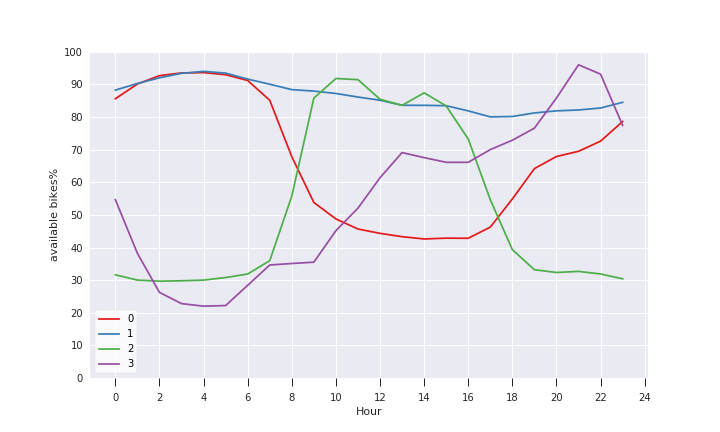
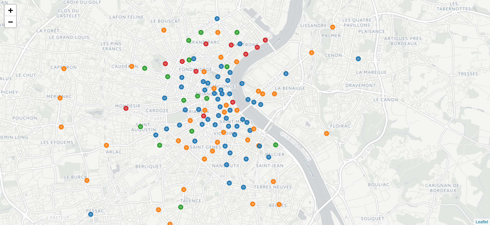
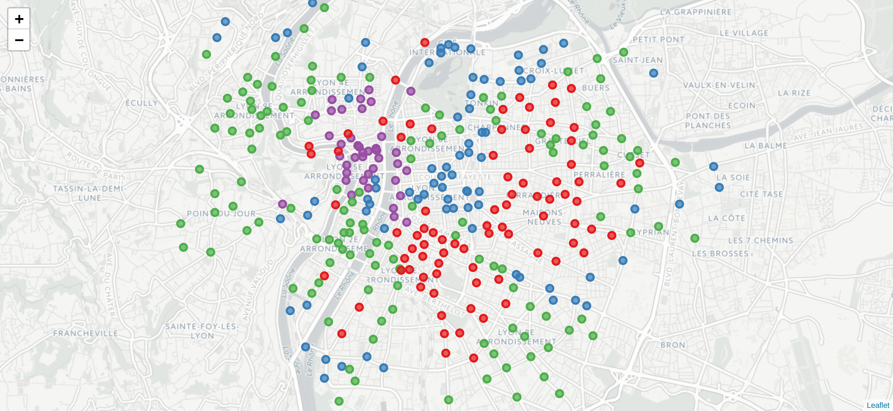
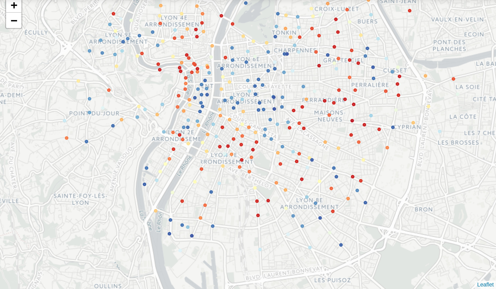

# Open Data Bikes Analysis

Analyze bikes sharing station data from Bordeaux and Lyon Open Data (French
cities).

Use the Python 3 programming language in Jupyter notebooks and the following
libraries: pandas, numpy, seaborn, matplotlib, scikit-learn, xgboost.

See the [requirements.txt](./requirements.txt) file for the dependencies.

## Clustering

Higly inspired by the
[Usage Patterns Of Dublin Bikes Stations](https://medium.com/towards-data-science/usage-patterns-of-dublin-bikes-stations-484bdd9c5b9e)
article and his great [notebook](https://github.com/jameslawlor/dublin-bikes-timeseries-analysis/blob/master/dublin-bikes-time-series-clustering-and-mapping.ipynb).

Analyze the daily profile and plot a map with a color for each usage pattern.

* [Notebook for usage pattern in Bordeaux](./Clustering-Bordeaux.ipynb)
* [Notebook for usage pattern in Lyon](./Clustering-Lyon.ipynb)

## Example of pattern

You can see the percentage of available bikes for 4 different daily
profiles. Note the analysis only keep job days.

* Blue profile: people who take bikes in the morning, roll them into 'green'
  stations and go back home in the evening.
* Green profile: opposite of the blue profile.
* Orange profile: not very used stations. Sometimes too far from city
  center. Sometimes very close the tramway stations.
* Red profile: stations where people go in the evening

## Maps

### Bordeaux Map Clustering

### Lyon Map Clustering

## Predict (draft)

Play with some different models to predict the number of available bikes (or a
kind of availability).

* See the script `prediction.py` which uses
  [XGBoost](http://xgboost.readthedocs.io/en/latest/model.html) to predict the
  bicycle-station availability
* [Notebook for prediction in Lyon](./Prediction-Lyon.ipynb)

### Prediction Map

From history data (two weeks), prediction at T+30 minutes for every station in
Lyon (France).

* Blue means there are several available bikes
* Red means there are just a few available bikes

## Data

* [Data Grand Lyon Website](https://data.grandlyon.com/equipements/station-vflov-disponibilitfs-temps-rfel/)
* [Data Bordeaux Website](https://data.bordeaux-metropole.fr/data.php?themes=10)

See the `lyon.tar.gz` and `bordeaux.tar.gz`.
